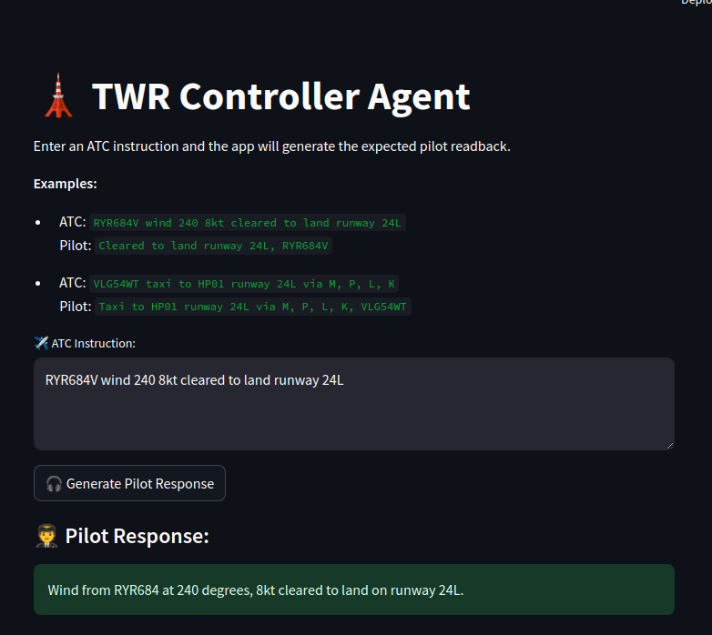
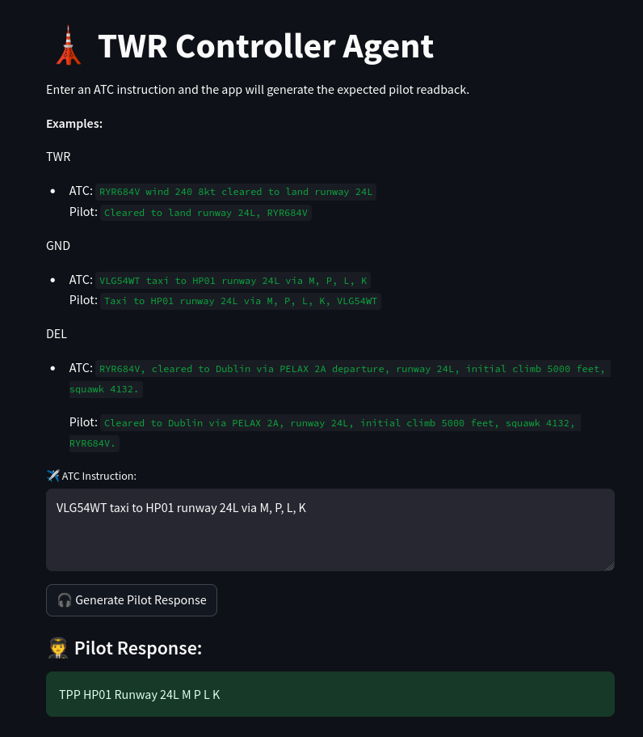
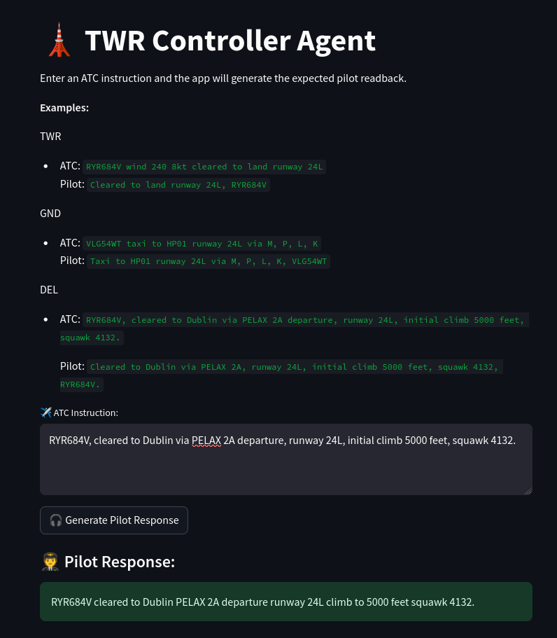

# Pilot response agent based on `deepseek-r1-distill-qwen-7b`

This application aims to implement an agent that acts as a pilot communicating with Air Traffic Control (ATC).

In standard ATC communications, the controller speaks first, and the pilot responds by repeating the essential parts of the message. This readback procedure ensures that the message has been clearly understood and helps prevent miscommunication.

ATC instructions typically come from three main units or dependencies, each responsible for a specific phase of the flight on the ground:

**Delivery (DEL):** Issues the initial clearance, including the departure route (SID), runway, squawk code, and initial altitude.

**Ground (GND):** Manages taxi clearances between the gate and the runway (or vice versa), including holding points and taxiways.

**Tower (TWR):** Handles clearances for takeoff and landing, as well as immediate traffic coordination near the runway.

Here are some **examples**:

    TWR
    - ATC: `RYR684V wind 240 8kt cleared to land runway 24L`  
    Pilot: `Cleared to land runway 24L, RYR684V`

    GND
    - ATC: `VLG54WT taxi to HP01 runway 24L via M, P, L, K`  
    Pilot: `Taxi to HP01 runway 24L via M, P, L, K, VLG54WT`
                
    DEL
    - ATC: `RYR684V, cleared to Dublin via PELAX 2A departure, runway 24L, initial climb 5000 feet, squawk 4132.`
    
    Pilot: `Cleared to Dublin via PELAX 2A, runway 24L, initial climb 5000 feet, squawk 4132, RYR684V.`    

In the first example, we see that the pilot repeats almost exactly what the controller said. However, non-essential information such as wind is intentionally omitted in the response. This helps reduce the time spent on the radio frequency, allowing other pilots to communicate more efficiently.


## Interface 





## APP

Using llmstudio and its SDK (Software Development Kit), I connected my Python script with a DeepSeek model (deepseek-r1-distill-qwen-7b). The input is an ATC (Air Traffic Controller) instruction, and the output is the expected pilot readback.

To customize the model’s behavior, I defined a set of instructions (the context), which I concatenate with the input before sending it to the model:

```python 
full_prompt = context + "\n\n" + prompt
```

Since the output was not what I expected (it included the reasoning), I added a layer to clean the response and extract only the relevant pilot phrase: 


```python 
    response_text = result.content.strip()
    if "<think>" in response_text:
        clean_response = response_text.split("<think>")[-1].strip().split("\n")[-1]
    else:
        clean_response = response_text.split("\n")[-1]
```

## Performace

Considering that this use case is quite straightforward, almost any LLM will perform well on the task given the right instructions as it only has to repit the same information. However, if we look at the first examples, despite specifying that wind information should not be repeated, the model includes it anyway.

These types of mistakes, while not ideal, are generally not critical in day-to-day operations, as they are unlikely to have any impact on actual airport procedures.